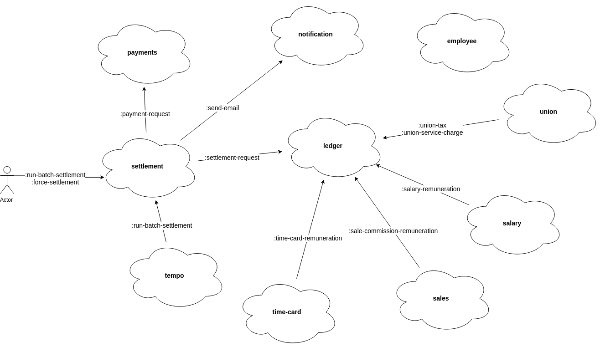

## The problem

A company needs to pay their employees in an organized, reliable and automatic way. Your job is to build a system to meet their needs.

#### Requirements

- Some employees work by hour. They are paid according to an hourly rate every Friday.
- Some employees are paid a flat salary at the last day of the month.
- Some employees are paid a commission based amount according to their sales. They receive a salary and the commission Friday with an interval of two weeks.
- Employees are paid via deposit to the informed bank account. 
- Employees receive a payslip via e-mail detailing the calculations of the final payment amount.
- Employees may belong to a union and they have a weekly tax to pay to the union. They also may use Union Services which are charged. Those values must be deduced when the employee is paid.
- The system must run automatically 9am everyday, paying every employee that is supposed to get paid as of that day.
- Each run should generate a report telling who got paid and the total amount paid in that run. The report should also include eventual failures occured, so it's possible to know if anyone didn't get paid.
- The system must allow for individual, manually triggered payments so in the case of a failure in an automatic run, it is possible to handle each case individually. Batch runs should also be triggerable manually, so if the daily task didn't run or a massive failure occured it's easier to just rerun the whole thing instead of handling each employee one by one).
- Running the payment task multiple times in a day **must not incur in undue payments** (i.e duplicates or any kind of overpayment must not happen).

## The solution

The implemented system consists of a set of services communicating to each other, like the image below.

The basic observation is that we can model the problem as each employee owning a personal ledger which holds every debit/credit the employee has with the company (e.g salary remuneration,
sales commission, a service charge and so on). Once we have this model, we've narrowed down the payment problem to a simple accrual of all entries in a 
employee's ledger within a specific timeframe.

Here is a brief description of each service in the proposed solution:

- **ledger**: Holds every credit/debit each employee has with the company. 

- **union**: Keeps a list of which employees have joined the union and weekly charges them a tax (by adding an entry to their ledger). It also charges employees when they use union services.

- **salary**: Keeps a list of salaried employees and remunerates them (by adding an entry to their ledger).

- **sales**: Keeps all sales records and gives employees a sale commission whenever they sale something (by adding an entry to their ledger).

- **time-card**: Keeps track of employees' time spent on work and remunerates them according to an hourly based rate.

- **employee**: Keeps a list of all company's employee. It's also responsible for telling the system whenever a new employee is added/updated, so the rest of the system can react to that.

- **settlement**: Responsible for calculating each employee final payment amount and generating the payment order. It also sends each employee a payslip detailing the calculations of the payment amount.

- **payments**: Takes payment orders and executes them (by integrating with 3rd party services like banking systems and so on).

- **notification**: Sends emails. Other kinds of notification could also be implemented like sms and push notifications.

- **tempo**: It's the clock of the system. Tasks like automatic daily settlements are scheduled here.

